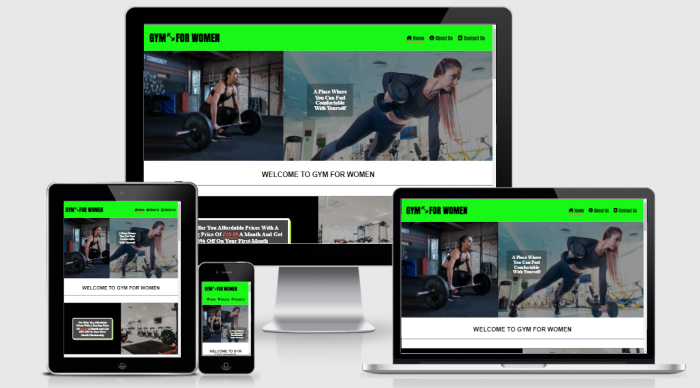
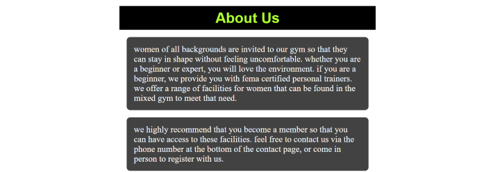

# GYM FOR WOMEN 

## introduction
The Gym for Women site was designed for women from diverse backgrounds who are uncomfortable in mixed gyms.

The website of GYM FOR WOMEN provides all the information users need about this gym: welcome for new customers, a joining discount for first-time customers, our weekly fitness classes, how to contact us, our opening and closing hours, where to find us, and finally, how to follow us on social media.

Website's link [GYM FOR WOMEN](https://hashim222.github.io/gym-for-womens/index.html)

# My choice of color for UX
### I chose a color scheme, which is both user-friendly and gym-friendly for the gym for women website. In the color reference section below, you will find a list of all the colors used on this site.

## Color Reference

| Color             | Hex                                                                |
| ----------------- | ------------------------------------------------------------------ |
| Black |  #000000 |
| Light Black |  #000000ad |
| Light Grey |  #00000046 |
| Very Light Grey |  #8080808c |
| Solid Dark Grey |  #000000bd |
| Transparent Grey |  #0000002c |
| White |  #ffffff |
| Bright Lime Green |  #00f700a1 |
| Light Lime Green |  #00f700a9 | 
| Greenyellow |  #acff2f |
| Red |  #f82a06 |
| Orange|  #ffa600 | 

# Font Used For UX

## There are three font styles used throughout this site:

* ### For the header and navigation bar, I used the ["Anton" font family](https://fonts.google.com/specimen/Anton).

* ### Throughout the page, there are some places I used ["Krona" font family](https://fonts.google.com/specimen/Krona+One).

* ### For some of the footer section, I used ["Fredoka" font family](https://fonts.google.com/specimen/Fredoka+One).

# Features

* ## Header 
  * A header is located at the top of the page, with a logo and navigation inside.

* ## Logo

  * The name of the gym is displayed in the left corner of the header.
  * Also, it's the logo for the gym for women. It links to the top of the page.

  

* ## Navigation 

  * Navigation is located in the header section, right corner.
  * There are three links in the navigation: Home, About Us, and Contact Us.
  * All navigation sections are on the same page, but are separated into different sections.
  * I made it easier for the user to navigate by adding icons to the navigation.
  * I left under the Home link a red bottom line to tell the user these are links.
  * When you scroll down the page, the navigation remains at the top of the page, making it easier for the user to get to the top of the page rather than scrolling at the top.

  

* ## Main Page 
  * With this section, we wanted to greet our users and welcome new users with a bonus.
  * The chart clearly shows that our new member of gym will receive a 10% discount on their first month's membership and that the monthly fee is clearly stated.
  * To encourage users to join our gym, an image of our indoor main workout area was added.

  

* ## Our Classes
  * To ensure our users are aware of our weekly classes so they can attend, I added large text to our weekly classes.
  * Added multiple images so that our users know what to expect in our weekly classes.

 

 * ## About Us
    * Upon clicking the about us link at the top of the navigation page, you will be directed to a section about us.
    * We want users to know what we're about before they join our gym by providing this page.

    

  * ## Contact Us
    * The contact us link at the top of the navigation page will take you to the contact us section, where you will find the form.
    *  The contact us section was created for users with any questions/enquiries about the gym. 
    * In this section, users will fill out the form by entering their personal information.

    