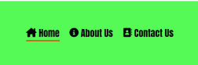

# GYM FOR WOMEN #

## introduction ##
Those who are not comfortable in mixed gyms can find comfort in Gym for Women, which is aimed at women with different backgrounds.

The website of GYM FOR WOMEN provides all the information users need about this gym: welcome for new customers, a joining discount for first-time customers, our weekly fitness classes, how to contact us, our opening and closing hours, where to find us, and finally, how to follow us on social media.We created this website to cater to women who don't feel comfortable going to a mixed gym.

Website's link [GYM FOR WOMEN](https://hashim222.github.io/gym-for-womens/index.html)

# Features #

* ## Header ##

   * I chose bright green as the background color for the header bright green / rgb(0, 247, 0, 0.664) and black / rgb(0, 0, 0) as the color. 
   * When you hover over navigation links, the color changes from black to light black / rgb(0, 0, 0, 0.678), and the underline has a red / rgb(248, 42, 6) color.

* ## Logo ##

  * The name of the gym is displayed in the left corner of the header.
  * Also, it's the logo for the gym for women. It links to the top of the page.

  

* ## Navigation ##

  * Navigation is located in the header section, right corner.
  * There are three links in the navigation: Home, About Us, and Contact Us.
  * The navigation is all on the same page divided into different sections.
  * I made it easier for the user to navigate by adding icons to the navigation.
  * I left under the Home link a red / rgb(248, 42, 6) bottom line to tell the user these are links.
  * When you scroll down the page, the navigation remains at the top of the page, making it easier for the user to get to the top of the page rather than scrolling at the top.

  

* ## Main Page ##
  * New users are welcomed to the gym with a long line underneath to make a text look more clear on the page.
  * We offer new members who join our gym a clear monthly price with color of tomato / rgb(255, 99, 71) and 10% off for joining us.
  * Image added for our inside main workout area.

  

* ## Our Clases ##
  * The text of our fitness classes is bold, with thick green-yellow lines underneath.
  * Through our classes, we ensure that our users are aware of our weekly classes so they are able to attend.
  * Added multiple images so that our users know what to expect in our weekly classes.

 

 * ## About Us ##
    * About us text made of combination of background color black / rgb(0, 0, 0) and font color bright yellowgreen / rgb(172, 255, 47).Added font family of "font-family: "Rubik Mono One", sans-serif;"
    * In the about us paragraph, the background color is dark-grey / rgba(0, 0, 0, 0.74) and all text color is white / rgb(255, 255, 255), with all text in lowercase for readability.
    * Upon clicking the about us link at the top of the navigation page, you will be directed to a section about us.
    * This page lets users know what we are about before they join our gym.

    