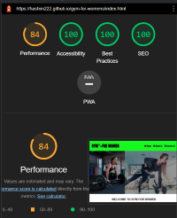
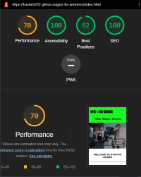

# Testing

* I tested this website on three different browsers: Google Chrome, Microsoft Edge and Firefox.
* The website works perfectly on all the different devices listed at the bottom of the text image.

  

# Bugs

* When I checked into the lighthouse, I encountered an accessibility lower score, so I had to change the color contrast from red to tomato.

  

## Accessibility 

* I checked accessibility using the Google Chrome dev tools lighthouse. I got a score of 100 for accessibility.

### Performance
* My project report was generated using Google Chrome lighthouse. I was having an issue that I kept getting a Low-Performance score, sometimes it got to below 85. When I tried checking in the incognito window mode, the same issue was occurring so I reached out to Slack to ask about this issue.  
Several Slack users helped me out by checking my project score on their own devices. The score appeared to be perfectly fine on their devices.  
However, I wasn't sure so I reached out to tutor support, and they confirmed their score was same as other users, which led me to realize the lower performance was related to hardware/software, rather than the code itself.  
As a result, I uploaded my lighthouse report screenshot and another user's report screenshot for my project, for mobile and desktop both.      
 
 ### Other User Screenshots.
* ### [Desktop](assets/images/readme-images/other-user-lighthouse-dekstop.png)

    
    
* ### [Mobile](assets/images/readme-images/other-user-lighthouse-phones.png)

  

 ### My own device screenshots.
* ### [Desktop](assets/images/readme-images/my-lighthouse-desktop.png)

  
    
* ### [Mobile](assets/images/readme-images/my-lighthouse-phones.png)

  

## Code Validator Testing
 * HTML 

    Checking the HTML code by using [W3C HTML Validator](https://validator.w3.org/#validate_by_input) did not find any errors.    
    
    

 * CSS 

    Checking the CSS code by using [W3C CSS Validator (Jigsaw)](https://jigsaw.w3.org/css-validator/#validate_by_input) did not find any errors.  

    